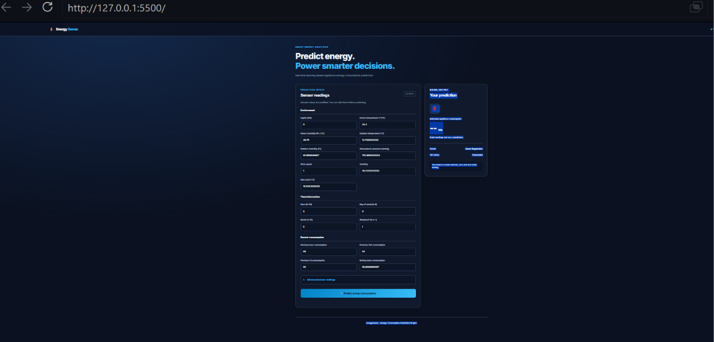

# Energy Consumption Prediction

A Machine Learning project that predicts household appliance energy consumption using environmental sensor readings, time-based features, and historical consumption data.

## Project Overview

This project uses the UCI Appliances Energy Prediction dataset to estimate appliance energy consumption. It includes data preprocessing, feature engineering, chronological dataset splitting, model training, evaluation, and a FastAPI

## Dashboard Preview

